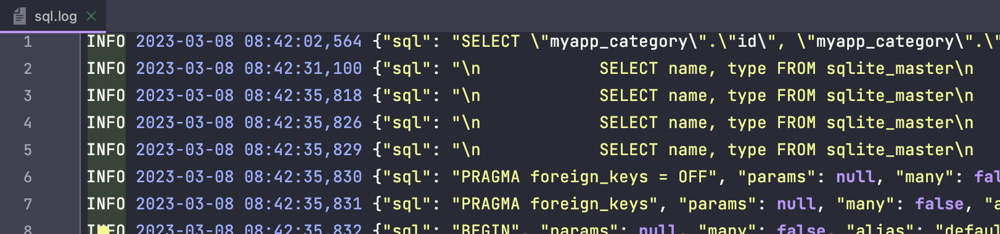

# django-sqllog

## 1. 목적
`django.db.connect`의 `cursor`를 통해 데이터베이스 서버에 전달되는 SQL Query를 로깅합니다.


## 2. 기능

- `django.db.connect`을 통해 전달되는 쿼리 로깅
- 로깅 기능 런타임 온/오프


## 3. 로깅 항목

* sql

  파라미터가 분리된 쿼리문

* params

  `sql`에 바인딩될 파라미터

* many

  여러 개의 Query 구문인지의 여부

* alias

  settings.DATABASES의 키 값으로써 쿼리가 실행된 DB 식별자

* duration

  쿼리 수행에 소요된 시간

* configuration

  사용된 설정값 식별자 ex) web, api 등 conf/settings/env.py 참조

* traceback

  쿼리 수행 지점까지의 프로그램 콜스택

* traceback_hash

  `traceback`의 MD5 해시값

* tables

  `sql`에 포함된 테이블명

* generalized_sql

  일반화된 쿼리문으로써 `표현`이 다른 쿼리라도 `형식`이 동일하면 같은 쿼리로 분류할 목적

* generalized_sql_hash

  `generalized_sql`의 MD5 해시값


## 4. 설치

### a. https 프로토콜 사용
```bash
pip install git+https://github.com/kncray/django-sqllog.git@latest
```

github 보안 정책에 따라 비밀번호를 이용할 수 없는 경우,

```bash
pip install git+https://{YOUR-TOKEN}@github.com/kncray/django-sqllog.git@latest
```

### b. SSH 프로토콜 사용
```bash
pip install git+ssh://git@github.com/kncray/django-sqllog.git@latest
```


## 5. 설정

### a. `settings.INSTALLED_APPS` 수정

```python
INSTALLED_APPS += [
    'sqllog',
]
```

### b. `settings.SQLLOG` 생성

```bash
SQLLOG = {
    'ENABLED': os.getenv('SQLLOG_ENABLED', True),
    'ENABLE_SENTRY': os.getenv('SQLLOG_ENABLE_SENTRY', False),
    'CONFIG_NAME': 'testing',
    'ENV_FILE_PATH': f'{BASE_DIR}/runtime/sqllog.ini',
    'LOGGING': {
        'formatters': {
            'sqllog': {
                'format': '%(levelname)s %(asctime)s %(message)s',
            },
        },
        'handlers': {
            'sqllog': {
                'class': 'logging.FileHandler',
                'filename': f'{LOG_ROOT}/sql.log',
                'formatter': 'sqllog',
            },
        },
        'loggers': {
            'sqllog': {
                'handlers': ['sqllog'],
                'level': 'INFO',
                'propagate': False,
            },
        }
    }
}
```


## 6. 결과



## 7. 기타 참고 사항

* 설정 파일(`settings.SQLLOG['ENV_FILE_PATH']`)이 없을 경우 새로 생성 및 비활성화
* 설정 파일이 없을 경우 로깅 비활성화
* 설정 파일을 삭제할 경우 로깅 비활성화
* 설정 파일이 포함된 디렉토리를 삭제할 경우 로깅 비활성화
* 설정 파일의 내용이 올바르지 않을 경우 로깅 비활성화
* 프로그램 재시작/재배포 시 설정 파일이 존재하고 활성화로 설정된 경우 로깅 **활성화**
* 설정 파일 형식
    ```conf
    [default]
    enabled=True
    sample_rate=1
    max_traceback_strlen=100
    ```
    * max_traceback_strlen
  
      기본값은 `None`입니다(Key/Value가 존재하지 않거나 `max_traceback_strlen=`와 같이 설정). traceback 필드의 최대 문자 수를 결정합니다. 

* Logstash로 직접 로깅할 경우 아래와 같이 설정합니다.
  ```bash
  SQLLOG = {
      'ENABLED': os.getenv('SQLLOG_ENABLED', True),
      'ENABLE_SENTRY': os.getenv('SQLLOG_ENABLE_SENTRY', False),
      'CONFIG_NAME': 'testing',
      'ENV_FILE_PATH': f'{BASE_DIR}/runtime/sqllog.ini',
      'LOGGING': {
          'formatters': {
              'sqllog': {
                  'format': '%(levelname)s %(asctime)s %(message)s',
              },
          },
          'handlers': {
              'sqllog': {
                  'class': 'logstash.LogstashHandler',
                  'host': 'localhost',
                  'port': 5959,
              },
          },
          'loggers': {
              'sqllog': {
                  'handlers': ['sqllog'],
                  'level': 'INFO',
                  'propagate': False,
              },
          }
      }
  }
  ```
  `logstash.LogstashHandler`는 `logstash.UDPLogstashHandler` 와 동일합니다. 
  `logstash.TCPLogstashHandler`로 변경할 수 있습니다
  ([참고](https://github.com/vklochan/python-logstash/blob/master/logstash/handler_udp.py)).
  